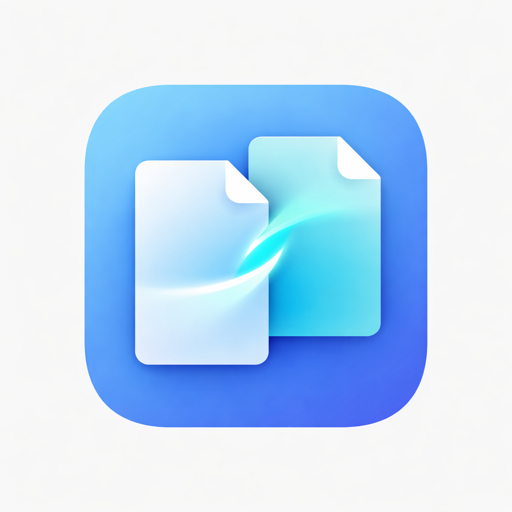

  

<h1 align="center">Unifyl</h1>

  <strong>The AI-powered dual-pane file manager for macOS.</strong> 
  Total Commander's depth. ForkLift's polish. Intelligence built in.

  <a href="https://github.com/goodbug89/Unifyl.app/releases">Download</a> · 
  <a href="https://github.com/goodbug89/Unifyl.app/issues">Report Bug</a>

---

## What is Unifyl?

Unifyl is a **native macOS file manager** built from the ground up with Swift 6, SwiftUI, and AppKit. It brings the powerful dual-pane workflow beloved by Total Commander users to macOS — with modern design, AI features, and Apple Silicon optimization.

## Key Features

### Dual-Pane File Management
- Side-by-side panels with tabs and workspaces
- Function key operations (F5 Copy, F6 Move, F7 MkDir, F8 Delete)
- Keyboard-first navigation with 120+ customizable shortcuts
- Drag & drop between panes

### AI Intelligence (Local & Private)
- **Semantic Search** — find files by meaning using local embeddings + vector DB
- **Smart Tagging** — auto-classify with NLP, integrated with macOS tags
- **AI Rename** — intelligent naming from image content (VLM) and document analysis
- **Privacy First** — all AI runs on Apple Neural Engine / CoreML. Nothing leaves your Mac.

### Archive Virtual Folders
Browse ZIP, 7z, TAR, GZ, BZ2, XZ, RAR, ZSTD archives as regular folders. Copy, move, rename, and delete files inside archives — including Korean filename support (EUC-KR/CP949).

### 10 Built-in Viewers
Text, hex, image, PDF, video, audio, web, Markdown, syntax-highlighted code, and media info — each in its own resizable window.

### Advanced Search
Multi-criteria with regex, size, date, content matching, and boolean logic. Feed results directly into Smart Folders for batch operations.

### Smart Folders (File Cart)
Collect files from multiple directories into a virtual folder. Perform batch copy, move, delete, rename — all from a single view with full panel functionality.

### File Compare & Sync
- Text diff (side-by-side)
- Binary hex compare
- Image overlay compare
- Directory compare & sync (bidirectional)
- 3-way merge with conflict resolution

### Developer Tools
- Git integration (status, stage, commit, push/pull, inline diff)
- Inline terminal with variable insertion ($F, $D, $S)
- Hex editor with pattern search
- SSH tunnel manager

### More
- Multi rename (regex, numbering, EXIF, AI, presets, undo)
- 12 built-in themes + custom theme editor
- SVG icon packs (100+ preset themes)
- EXIF/metadata batch editor
- Checksum verification (MD5, SHA-256, Blake3, etc.)
- Cloud & remote connections (FTP, SFTP, WebDAV, S3, Google Drive, Dropbox, OneDrive)
- macOS tags with color-coded display
- Undo/redo for file operations
- VoiceOver accessibility support
- Localization-ready (Korean, English)

## System Requirements

| | Minimum |
|---|---|
| **macOS** | 14.0 Sonoma or later |
| **Architecture** | Apple Silicon (optimized) + Intel supported |
| **Memory** | 4 GB RAM |
| **Disk** | 100 MB |

## Tech Stack

| Area | Technology |
|---|---|
| Language | Swift 6.0 (Strict Concurrency) |
| UI | SwiftUI + AppKit hybrid |
| Concurrency | async/await, Actor isolation |
| AI | CoreML + Metal Performance Shaders |
| Updates | Sparkle |
| Build | Xcode + Swift Package Manager |

## Pricing

| Tier | Price | Includes |
|---|---|---|
| **Free** | $0 | Dual-pane, tabs, basic search, FTP/SFTP, ZIP, 2 cloud connections |
| **Pro** | $39.99 (one-time) | Everything: AI features, all archives, all protocols, multi rename, compare/sync, developer tools, themes |

## License

Copyright © 2026 Unifyl. All rights reserved.

## Links

- [Website](https://goodbug89.github.io/Unifyl.app)
- [Releases](https://github.com/goodbug89/Unifyl.app/releases)
- [Issues](https://github.com/goodbug89/Unifyl.app/issues)
