<p align="center">
  
</p>

<h1 align="center">Unifyl</h1>

<p align="center">
  <strong>The AI-powered dual-pane file manager for macOS.</strong><br>
  Total Commander's depth. ForkLift's polish. Intelligence built in.
</p>

<p align="center">
  
  
  
  
</p>

<p align="center">
  <a href="https://unifyl.app">Website</a> &middot;
  <a href="https://github.com/goodbug89/Unifyl.app/wiki">Documentation</a> &middot;
  <a href="https://github.com/goodbug89/Unifyl.app/releases/latest">Download</a>
</p>

<p align="center">
  <strong>Language:</strong>
  <strong>English</strong> &middot;
  <a href="README.ko.md">한국어</a> &middot;
  <a href="README.ja.md">日本語</a> &middot;
  <a href="README.zh-Hans.md">简体中文</a> &middot;
  <a href="README.zh-Hant.md">繁體中文</a> &middot;
  <a href="README.de.md">Deutsch</a> &middot;
  <a href="README.es.md">Español</a> &middot;
  <a href="README.fr.md">Français</a> &middot;
  <a href="README.it.md">Italiano</a> &middot;
  <a href="README.pt-BR.md">Português</a> &middot;
  <a href="README.ru.md">Русский</a> &middot;
  <a href="README.ar.md">العربية</a> &middot;
  <a href="README.tr.md">Türkçe</a> &middot;
  <a href="README.th.md">ไทย</a> &middot;
  <a href="README.vi.md">Tiếng Việt</a>
</p>

---


## Gallery

| | |
|---|---|
| 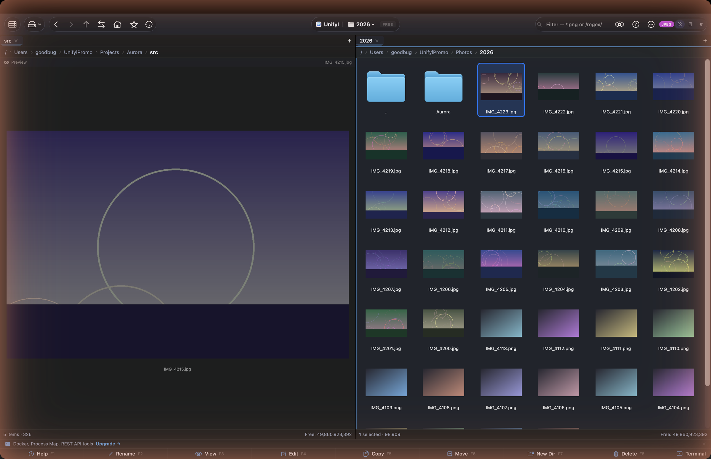 **Quick Look in panel** — hit Space on any file for an instant preview right where you are. | 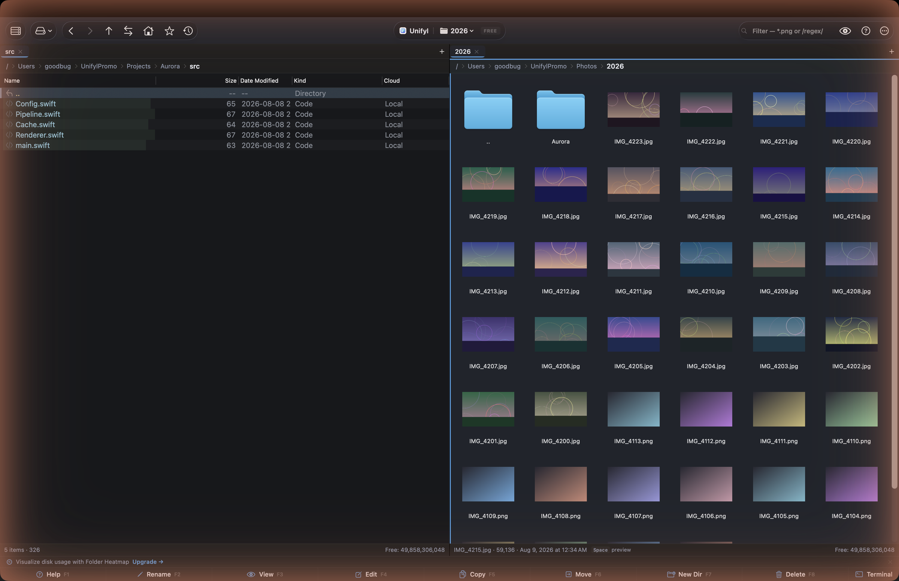 **Thumbnail grid (⌃G)** — flip any panel into a Finder-style icon grid; selection survives the toggle. |
| 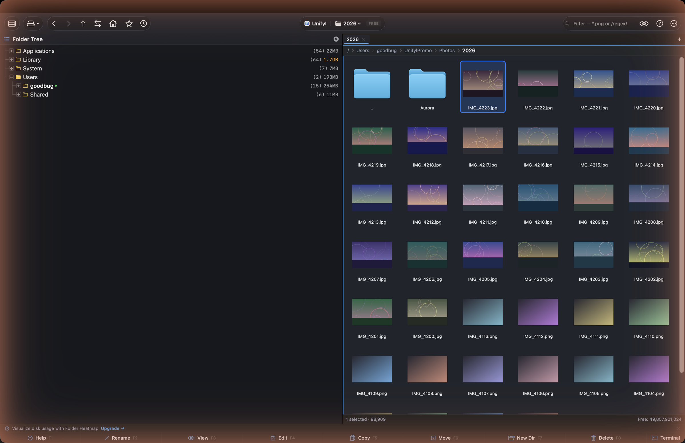 **Folder tree sidebar (⌃T)** — keep the whole filesystem one click away while you work in the active panel. | 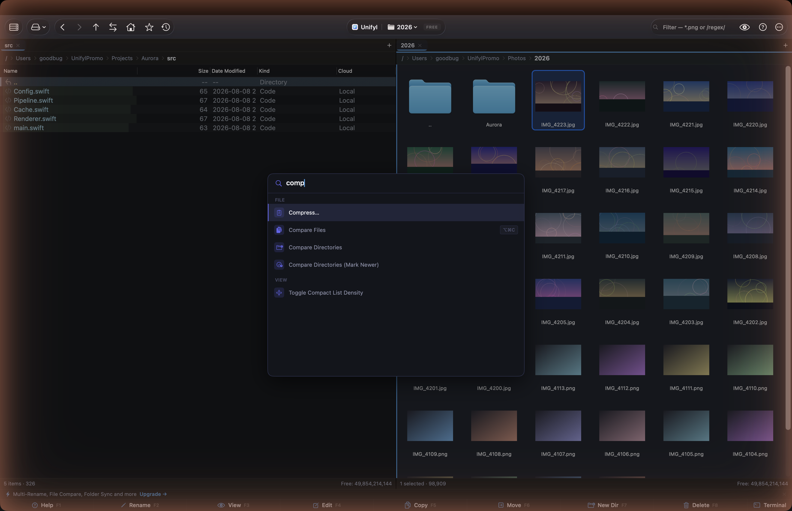 **Command palette (⌘⇧P)** — fuzzy-search every command, no menu hunt. |
| 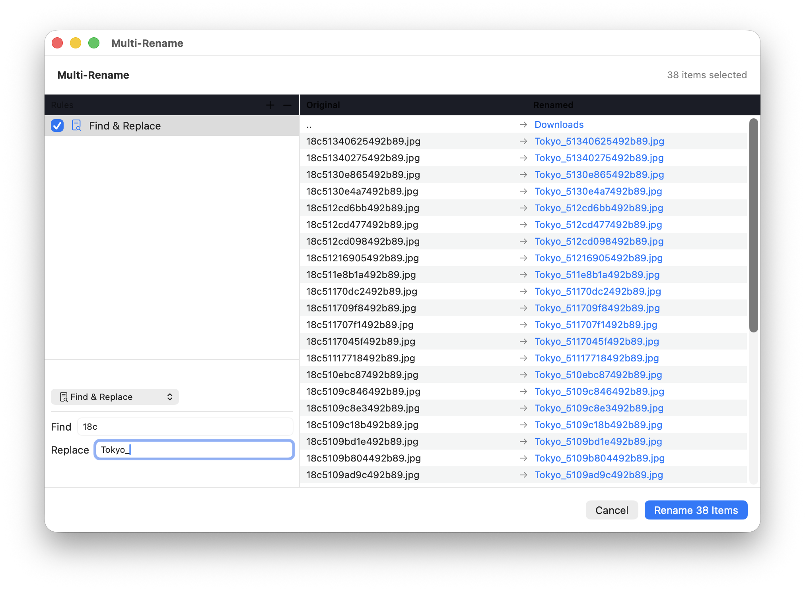 **Multi-Rename** — find/replace, regex, EXIF, AI suggestions, numbering. Live preview, ⌘Z to undo the whole batch. | 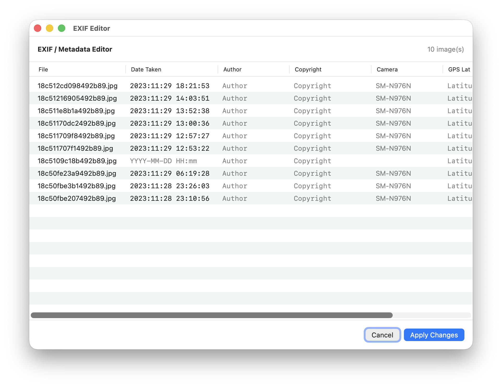 **EXIF / metadata editor** — batch-edit date taken, GPS, author, copyright across N images at once. |
| 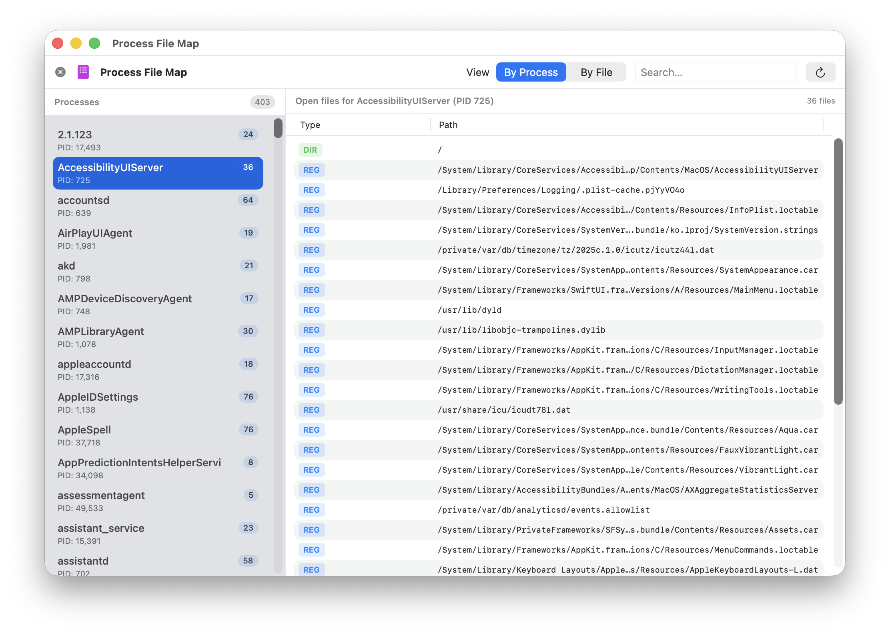 **Process map** — see every open file held by every running process, by-process or by-file. | 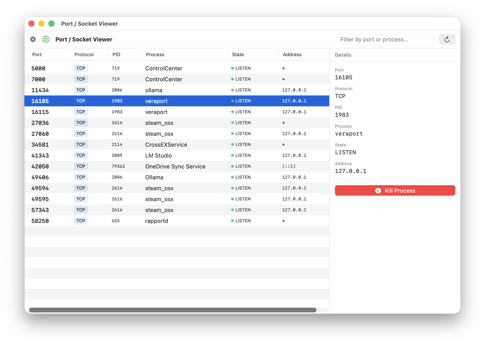 **Port viewer** — every listening port + the process behind it. SIGKILL with one click. |
| 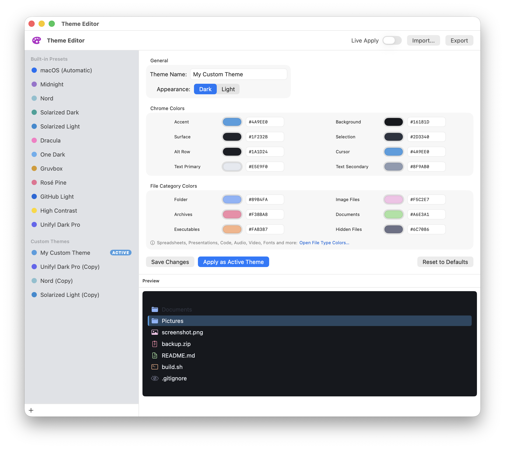 **Theme editor** — 12 built-in presets + 20+ tunable color tokens, live preview, export to `.ultratheme`. | 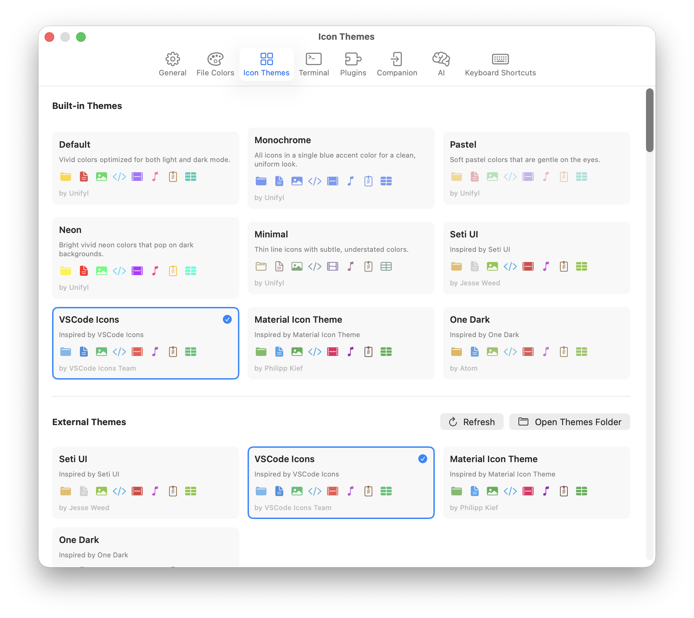 **Icon themes** — VSCode Icons, Material, Seti, One Dark, Pastel, Neon, Minimal, Monochrome — built-in or import from disk. |
| 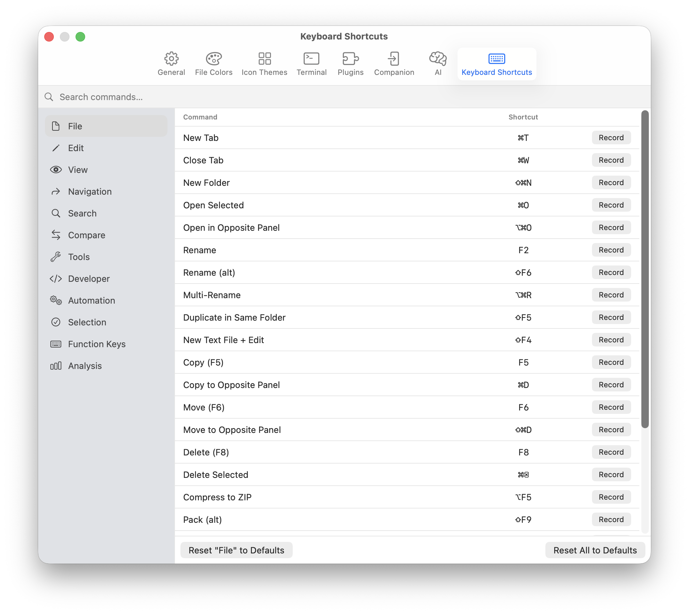 **120+ rebindable shortcuts** with conflict detection, search, and per-category reset. | 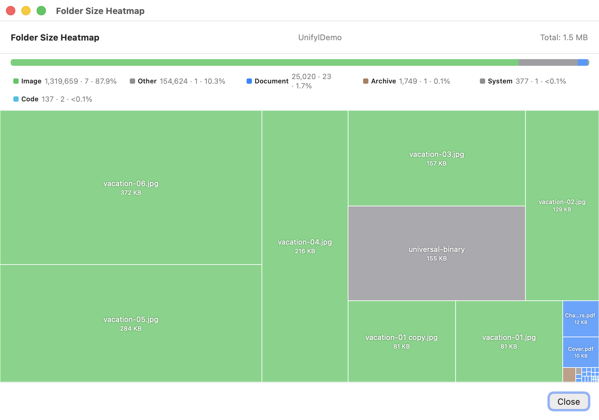 **Folder size heatmap** — what's eating disk space, colour-coded by file type, in one glance. |

## Features

### :file_folder: Dual-Pane File Management

- Single, dual, triple, and free-split pane layouts
- Tabbed browsing with tab groups and persistent workspaces
- Drag-and-drop with spring-loaded folders
- Queue manager with pause, resume, and speed throttling
- Inline terminal per pane

### :mag: Search & Filter

- Real-time filtering as you type
- Regex and wildcard pattern matching
- Spotlight integration for instant system-wide search
- Content search across file bodies
- Advanced filters by size, date, kind, and tags

### :robot: AI-Powered Tools

- **Semantic search** -- find files by meaning, not just name (local embeddings + vector DB)
- **AI rename** -- suggest filenames from image recognition or document content
- **Smart tagging** -- auto-classify files using on-device NLP
- **Duplicate intelligence** -- perceptual hashing to surface near-duplicates
- **Natural language commands** -- tell the command palette what you want in plain English
- All AI processing runs locally on Apple Neural Engine. Your files never leave your Mac.

### :globe_with_meridians: Remote & Cloud

- FTP, FTPS, SFTP (PPK, FIDO2, 2FA), WebDAV, SMB (requires Samba)
- Amazon S3, Backblaze B2, Google Cloud Storage, Azure Blob
- Google Drive, Dropbox, OneDrive, iCloud Drive
- Docker container and Kubernetes pod browsing
- iOS/Android device connectivity

### :wrench: 50+ Professional Tools

- File → PDF conversion (images, text, Office docs via LibreOffice; HWP / HWPX with Hancom-app fallback when LibreOffice's filter rejects the file)
- Multi-rename with regex, numbering, EXIF data, AI suggestions, and undo
- Text diff, binary hex compare, image overlay, recursive directory diff
- 3-way file merge with per-conflict Accept Left/Right/Both
- Bidirectional directory sync (local and remote)
- Archives as virtual folders: browse, copy, move, delete inside ZIP, 7z, TAR, GZ, BZ2, XZ, ZSTD, RAR, **ALZ** (Korean ESTsoft format via bundled `unalz`, read-only — listing + extract)
- Encrypted archives: ZIP and 7z password support
- Smart filename decoding for legacy CJK ZIPs — Chinese (CP936/GBK), Japanese (Shift-JIS), Korean (CP949) detected by Hangul/Kana/Hanja distribution, not by guess
- **HWP inline preview** — drop a `.hwpx` (Hancom Office) onto the panel and the body text renders in-place via pure-Swift section-XML extractor; no Hancom install required for read-only preview
- **Multilingual filename search** — type "wen" to match `文書/文件/文字` (Pinyin → Hanzi via CC-CEDICT), "tokyo" to match `東京` (Romaji → Kana → Kanji), "한글" to match `韓國語` (Hangul → Hanja via Unihan). Opt-out in Settings > General.
- Overwrite confirmation dialogue when extracting or copying out of archives (Skip / Rename / Overwrite, with "Apply to all")
- Entry mtimes preserved on extract — no more "extracted file is 9 hours off" on KST machines
- Inline hex editor with pattern search and edit/save
- EXIF/metadata bulk editor: batch edit date, GPS, author, copyright
- Incremental backup with delta analysis (new, modified, unchanged)
- Real-time log viewer with keyword highlighting and filter
- File operation undo/redo (copy, move, delete reversible)
- Macro recorder: record file operations, save, replay with variables
- Multi-panel workspace layouts: save and restore tab arrangements
- File operation scheduler with cron-based automation
- Checksums: CRC32, MD5, SHA-1/256/512, SHA-3, BLAKE3
- App uninstaller with leftover cleanup
- Automation engine: Shell, AppleScript, JavaScript (JXA)

### :computer: Developer Tools

- Git integration panel: status, stage/unstage, commit, push/pull, inline diff
- SSH tunnel manager: save port forwarding profiles, start/stop tunnels
- Docker container file editing with auto-sync
- Process map, port viewer, environment manager, REST API explorer

### :art: Customizable Themes

- Light and dark mode with system auto-switching
- 12 built-in presets: Classic Navy, Midnight, Nord, Solarized, and more
- Full theme editor with 20+ color tokens
- Export and share `.ultratheme` files
- Per-filetype color coding

### :keyboard: Keyboard-First Design

Every action is reachable from the keyboard. Command palette (`Cmd+Shift+P`), Vim-style navigation, and full shortcut customization. Remap any of 120+ commands across 12 categories in Settings > Keyboard Shortcuts, with conflict detection and one-click reassignment.

### :earth_americas: 15 Languages

English, Korean, Japanese, Chinese (Simplified & Traditional), German, French, Spanish, Portuguese (Brasil), Italian, Russian, Turkish, Arabic (RTL), Thai, Vietnamese. The marketing site, README, and OS-level integration (Finder names, copyright, document type display names via per-locale `InfoPlist.strings`) all ship localised in addition to the in-app UI.

---

## Installation

### Download

Get the latest release from [unifyl.app/download](https://github.com/goodbug89/Unifyl.app/releases/latest).

Also available on the [Mac App Store](https://apps.apple.com/app/unifyl/id6773977314?mt=12) (sandboxed edition — see FAQ for feature differences).

1. Open the `.dmg` file
2. Drag Unifyl to your Applications folder
3. Launch and grant file access when prompted

### Homebrew

```bash
brew install goodbug89/unifyl/unifyl
```

Recent Homebrew versions ask you to trust third-party taps once first:
`brew trust goodbug89/unifyl`. Installs the notarized direct-distribution
build (auto-updates via Sparkle).

---

## Pricing — Free download, Pro $24.99 one-time

Since **1.4.0** Unifyl is free to download from both the Direct site
and the Mac App Store. A single one-time purchase of **Pro** unlocks
the full power-user feature set.

| | **Free** (anyone) | **Pro — $24.99 once** |
|---|---|---|
| Pane layouts | Dual / triple / free-split (all) | (same) |
| Tabs & workspaces | Unlimited | (same) |
| Search | Filename + Spotlight + CJK multilingual | + in-file content search (regex) |
| Remote connections | FTP, SFTP | + FTPS, WebDAV, SMB, all cloud (Google Drive, Dropbox, OneDrive, S3, B2, GCS, Azure Blob) |
| Archives | ZIP read | + ZIP/7z/TAR/RAR write + modify in place + ALZ |
| Compare & sync | — | File diff, directory diff, folder sync, 3-way merge |
| Multi-rename | — | Regex + EXIF + AI suggestions + presets |
| AI tools | — | Semantic search, auto-classify, AI rename, dedup, summarization (all on-device) |
| What Free can't do | — | Prove two folders match · rename hundreds at once · search inside files · every cloud · heatmap, hex editor, file X-ray … plus Git panel, Docker and SSH tunnel *(direct download only)* |
| Themes | All 12 built-in + 15 locales + Function Key Bar + Quick Look | (same) |

> **Edition note.** The Mac App Store build is sandboxed and does not include the Git panel, Docker/Kubernetes, SSH tunnels, the inline terminal, the port and process viewers, or ffmpeg-based media conversion — macOS forbids them there. Everything else is identical, and Pro is the same one-time price on both. Choose the direct download if you need any of those.

**One-time purchase. No subscription. Pay once, own it forever on
that Mac.** Direct purchase via LemonSqueezy (Apple Pay, card,
transferable across 3 devices) or via App Store In-App Purchase
(tied to Apple ID, supports Family Sharing). 14-day free Pro trial
on first launch.

---

## Keyboard Shortcuts

| Shortcut | Action |
|---|---|
| `Cmd + Shift + P` | Command palette |
| `Tab` | Switch active pane |
| `Return` | Open file / Enter folder (cursor item only) |
| `Shift + Return` | Rename selected file |
| `Space` | Quick Look preview |
| `Cmd + Delete` | Move to Trash |
| `Cmd + Z` | Undo last file operation |
| `Cmd + Shift + N` | New folder |
| `Cmd + F` | Find / filter |
| `Cmd + Shift + F` | Advanced search |
| `Cmd + Opt + F` | Content search |
| `Cmd + Opt + S` | AI Semantic search |
| `Ctrl + F7` | Advanced search panel |
| `Insert` | Toggle select + move down |
| `Shift + ↓/↑` | Toggle select range |
| `Ctrl + S` | Add to Smart Folder |
| `Cmd + T` | New tab |
| `Cmd + W` | Close tab |
| `Cmd + 1` | Single pane layout |
| `Cmd + 2` | Dual pane layout |
| `Cmd + K` | Open terminal |
| `Cmd + Opt + C` | Compare files |
| `Cmd + Opt + G` | Git panel |
| `Cmd + I` | Get Info |

All shortcuts are customizable in Settings > Keyboard Shortcuts.

---

## Building from Source

### Requirements

- macOS 14 Sonoma or later
- Xcode 16.0+
- Swift 6.0+

### Steps

```bash
git clone https://github.com/goodbug89/Unifyl.app.git
cd unifyl

# Verify your toolchain (xcodegen / swift / dmgbuild / 7zz / notarytool …)
make doctor

# Generate Xcode project
make gen

# Build all packages — sequentially with clean log per package
make build

# Or in parallel (8.0s → 0.5s no-op rebuild, ~3s cold)
make build-fast

# Run tests
make test

# Lint + check that user docs / in-app help / KeyBindingManager don't drift
make lint
```

See the Makefile for all available targets.

---

## Plugin Development

Extend Unifyl with `.unifylplugin` bundles. Six plugin types are supported: Viewer, Packer, Content, FileSystem, Action, and AI.

```swift
import UnifylPluginSDK

public class MyViewerPlugin: ViewerPlugin {
    public var manifest: PluginManifest { ... }
    public func canView(_ url: URL) -> Bool { ... }
    public func makeView(for url: URL) -> AnyView { ... }
}
```

Install plugins to `~/Library/Application Support/Unifyl/Plugins/`. SDK documentation coming soon.

---

## Contributing

Unifyl is proprietary software. We welcome:

- **Bug reports** -- open an issue with reproduction steps
- **Feature requests** -- describe your workflow and what you need
- **Translations** -- help us reach more languages
- **Plugins** -- build on the plugin SDK

---

## License

Proprietary. Copyright 2024-2026 Unifyl. All rights reserved.

---

<p align="center">
  <a href="https://unifyl.app">Website</a> &middot;
  <a href="https://github.com/goodbug89/Unifyl.app/wiki">Docs</a>
</p>
