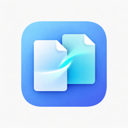
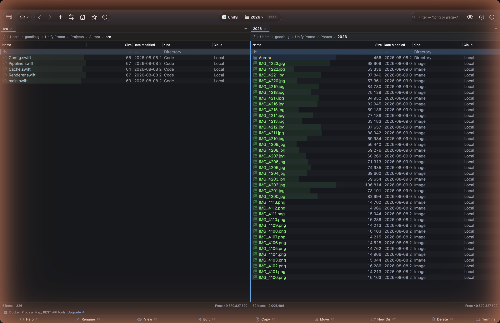

<h1 align="center">Unifyl</h1>

<strong>Двухпанельный файловый менеджер с ИИ для macOS.</strong> Глубина Total Commander, отделка ForkLift, встроенный ИИ.

<a href="https://unifyl.app/ru/">Сайт</a> &middot; <a href="https://github.com/goodbug89/Unifyl.app/wiki">Документация</a> &middot; <a href="https://github.com/goodbug89/Unifyl.app/releases/latest">Загрузить</a>

Также доступно в <a href="https://apps.apple.com/app/unifyl/id6773977314?mt=12">Mac App Store</a> (версия в песочнице — различия функций см. в FAQ).

<strong>Язык:</strong> <a href="README.md">English</a> &middot; <a href="README.ja.md">日本語</a> &middot; <a href="README.zh-Hans.md">简体中文</a> &middot; <a href="README.de.md">Deutsch</a> &middot; <a href="README.es.md">Español</a> &middot; <a href="README.fr.md">Français</a> &middot; <strong>Русский</strong>

---

## Обзор

Unifyl — двухпанельный файловый менеджер для macOS, объединяющий профессиональные инструменты и локальный ИИ. Ваши файлы никогда не покидают Mac.

- **Две панели** — одиночные/двойные/тройные/свободные раскладки, вкладки, рабочие пространства, встроенный терминал в каждой панели
- **На базе ИИ** — семантический поиск, переименование с ИИ, умные теги, обнаружение дубликатов — всё локально на Apple Neural Engine
- **Удалённо и в облаке** — FTP/SFTP/WebDAV/SMB/S3/Google Drive/Dropbox/OneDrive/Docker/Kubernetes
- **Более 50 профессиональных инструментов** — пакетное переименование, сравнение текста/бинарных файлов/изображений, синхронизация каталогов, 3-стороннее слияние, пакетный редактор EXIF
- **Архивы как виртуальные папки** — ZIP/7z/TAR/GZ/BZ2/XZ/ZSTD/RAR (включая авто-определение кодировки CJK-архивов)
- **Клавиатура прежде всего** — палитра команд, Vim-стиль навигации, более 120 переназначаемых сокращений
- **15 языков**
- **CJK-усиление** (1.3.0): извлечение архивов `.alz` (встроенный `unalz`), встроенный просмотр `.hwpx`, многоязычный поиск имён файлов (Pinyin / Romaji / Hangul-Hanja)
- **Расширенное усиление CJK** (1.3.1): автозакладки для папок мессенджеров/облаков (KakaoTalk · LINE · WeChat · iCloud Drive — 12 путей), сворачивание полной/половинной ширины при поиске, преобразование кодировки EUC-KR/Shift-JIS/GBK → UTF-8 (с отменой), эвристическое обнаружение бланков корейского правительства

## Цена

| | **Free** | **Pro — $24.99** |
|---|---|---|
| Раскладки панелей | Двойная/тройная/свободное разделение (все) | Одна/две/три/свободно |
| Инструменты ИИ | — | Все функции ИИ |
| Удалённые соединения | FTP, SFTP | Все протоколы + облако |
| Архивы | ZIP | ZIP/7z/TAR/GZ/BZ2/XZ/ZSTD/RAR/**ALZ** |

> **О редакциях.** Версия из Mac App Store работает в песочнице и не включает панель Git, Docker/Kubernetes, SSH-туннели, встроенный терминал, просмотр портов и процессов, а также конвертацию медиа на основе ffmpeg — macOS этого там не разрешает. Всё остальное идентично, и Pro стоит одинаково — единовременный платёж в обоих случаях. Если что-то из перечисленного нужно, выберите прямую загрузку.

Разовая покупка, без подписки. Бесплатная загрузка в Mac App Store (Pro через встроенную покупку, привязан к Apple ID с Семейным доступом) или прямая загрузка (Pro через LemonSqueezy, до 3 устройств). 14-дневный бесплатный пробный период Pro при первом запуске.

Полный список функций, сокращений, руководство по сборке и разработке плагинов — в [англоязычном README](README.md).

## Лицензия

Проприетарная. Copyright 2024–2026 Unifyl. Все права защищены.
